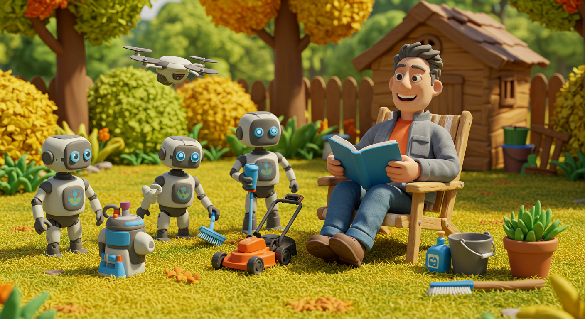

# Decoding AI: Today & Tomorrow

This repository contains slides and demo resources for the presentation below.

## Summary

The speaker of this program will be Bob Hong, an innovation leader and technology strategist.  He will review the latest development of AI and share with us his expertise in unlocking the full potential of AI tools for use in everyday life.

## Event Details (Original)

https://bit.ly/4hPbqCE

**Decoding AI: Today & Tomorrow**

Sunday, February 23 · 6:30 – 8:00pm
Time zone: America/New_York

Google Meet joining info
[Video call link](https://meet.google.com/fwb-aeke-ffw)

Or dial: ‪(US) +1 747-242-3856‬ PIN: ‪127 013 957‬#
[More phone numbers](https://tel.meet/fwb-aeke-ffw?pin=7178090521927)

> Note: Links to the video call will not work after the event, but the recording link, slides and resources will be available here.

## Contents

[Decoding AI: Today & Tomorrow PDF](./Decoding%20AI_%20Today%20&%20Tomorrow.pdf)

## Recording
- stay tuned...

### Demos

- [Adventure-Game](./demos/sample-prompts/Adventure-Game.md)
- [Prompt Styles](./demos/sample-prompts/Prompt-Styles.md)
- [Socrates Fact Checker](./demos/socrates/README.md)
- [Snowfall Predictor](./demos/sample-prompts/snowfall/README.md)
- [Research Example](./demos/research/README.md)
- [Notebook LM Generated Podcast - Briefing for Alien Visitors](https://drive.google.com/file/d/13WPX9TIvIJW5gqJYlVHs3CCvgG3koRr4/view?usp=sharing)
- [MusicFX Demo](https://drive.google.com/file/d/1V-pI11-2UsTuei-y1OpHqUWBdrcOrc82/view?usp=sharing)

### Tools

Links to chatbots and other AI tools will be provided here.

    ### Tools

    - [ChatGPT](https://chatgpt.com/)
        - OpenAI's flagship chatbot
        - Excels at general knowledge, coding, and creative writing
        - Multiple model versions (3.5, 4.0) with different capabilities

    - [Perplexity](https://perplexity.ai/)
        - Real-time internet search integration
        - Cites sources automatically
        - Focused on accurate, up-to-date information

    - [Google Gemini](https://gemini.google.com/)
        - Strong multimodal capabilities (text, images, code)
        - Deep integration with Google's knowledge base
        - Advanced mathematical and analytical abilities

    - [Claude](https://claude.ai/)
        - Anthropic's AI with strong reasoning capabilities
        - Handles longer context windows
        - Known for technical writing and analysis

    - [Microsoft CoPilot](https://copilot.microsoft.com/)
        - Integrated with Microsoft 365 suite
        - Strong at creative content and coding
        - Real-time web search capabilities

    - [Grok](https://grok.com/)
        - xAI's chatbot with real-time X/Twitter data access
        - Known for witty responses
        - Designed for more informal interactions

    - [DeepSeek](https://chat.deepseek.com/)
        - Specialized in coding and technical tasks
        - Open-source focus
        - Strong mathematical capabilities

    - [Notebook LM](https://notebooklm.google.com/)
        - Google's focused research assistant
        - Document analysis and summarization
        - Collaborative note-taking features

    - [ChatBot Arena](https://lmarena.ai/)
        - Compare different AI models side-by-side
        - Benchmark performance
        - Community-driven evaluations

## License

MIT License
